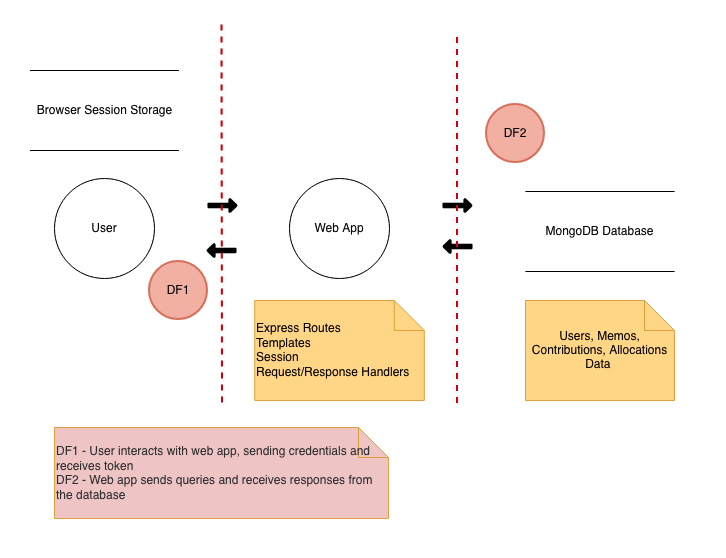
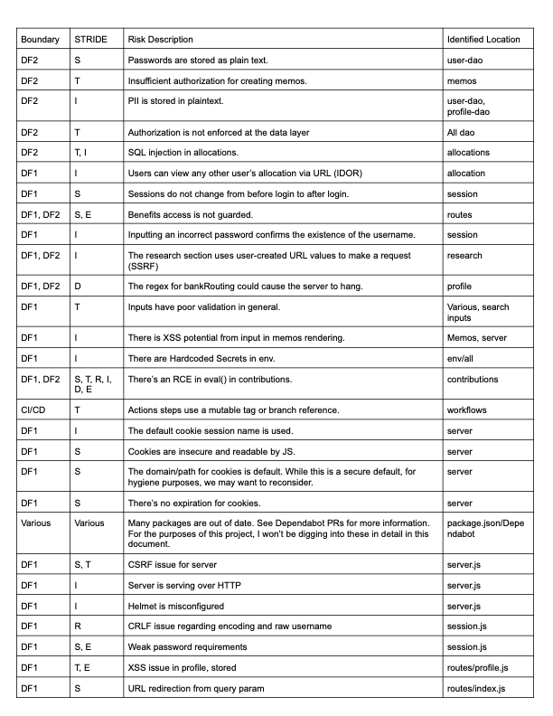
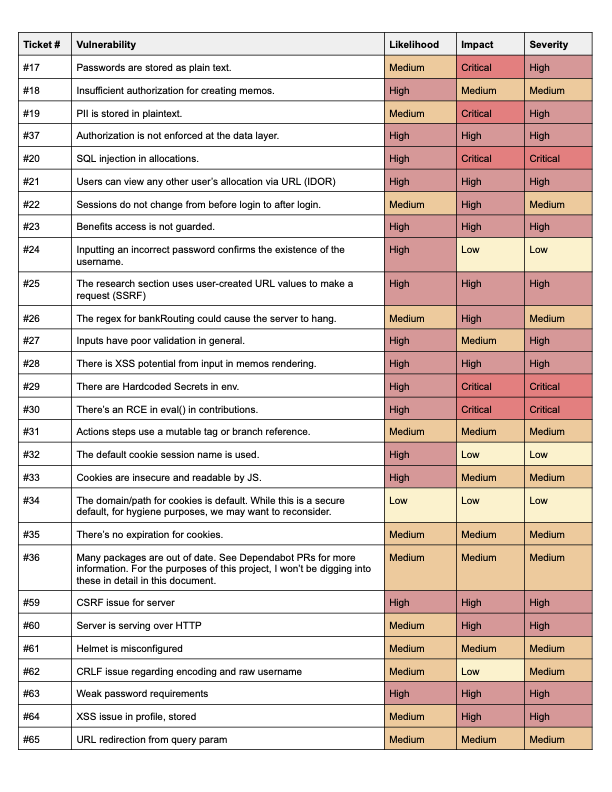

# Fortified NodeGoat 

This is a fork of [NodeGoat](https://github.com/owasp/nodegoat), which is a vulnerable Node.js application crafted by OWASP for learning purposes. On this fork, I've added a threat model (see below), risks, a [project board](https://github.com/users/CassandraGoose/projects/5/views/1), and am working through the tickets to address the vulnerabilities. 

## Table of Contents
- [App](#app)
- [Data Flow Diagram](#data-flow-diagram)
- [STRIDE Analysis](#stride-analysis-currently-updated-throughout-retrospective-exploration-phase)
- [Risks](#risks)
- [Set Up](#set-up)
- [License](#license)

## App

This application allows users to sign up, log in, and log out to manage their retirement plan and benefits. Users can view and edit profile information, adjust contributions, view stocks/funds/bonds, get a stock quote, and interact with a message board. Administrators can edit users' benefits. 

A typical flow may look like: 

User:
- User logs in
- User interacts with contributions, stocks, and message board. 
- User logs out

Admin:
- Admin logs in
- Admin interacts with one user's benefits
- Admin logs out

## Data Flow Diagram



## STRIDE Analysis Currently (Updated throughout retrospective exploration phase)

The initial results have been added based on an exploration of the codebase and the results of a SAST scan. Items may be added after the DAST is implemented or at any other time. 



## Risks



## Set Up

##### Default user accounts

The database comes pre-populated with these user accounts created as part of the seed data -
* Admin Account - u:`admin` p:`Admin_123`
* User Accounts (u:`user1` p:`User1_123`), (u:`user2` p:`User2_123`)
* New users can also be added using the sign-up page.

### Steps to get started locally:

1) Install [Node.js](http://nodejs.org/) - NodeGoat requires Node v8 or above

2) Clone the github repository:
   ```
   git clone https://github.com/OWASP/NodeGoat.git
   ```

3) Go to the directory:
   ```
   cd NodeGoat
   ```

4) Install node packages:
   ```
   npm install
   ```

5) Run MongoDB in Docker. The app uses the legacy MongoDB driver (v2.x), which speaks the wire protocol that MongoDB 6.0+ removed — so you must use `mongo:4.4`, the last version that supports it:
   ```
   docker run -d -p 27017:27017 --name nodegoat-mongo mongo:4.4
   ```
   > If you have a local MongoDB service installed, stop it first — both can't bind to port 27017. On macOS with Homebrew: `brew services stop mongodb-community`.

   The app connects to `mongodb://localhost:27017/nodegoat` by default, so the container is all you need. (To use a different instance, set the `MONGODB_URI` environment variable.)

6) Populate MongoDB with the seed data required for the app:
   ```
   npm run db:seed
   ```
   By default this will use the "development" configuration, but the desired config can be passed as an argument if required.

7) Start the server. You can run the server using node or nodemon:
   * Start the server with node. This starts the NodeGoat application at [http://localhost:4000/](http://localhost:4000/):
     ```
     npm start
     ```
   * Start the server with nodemon, which will automatically restart the application when you make any changes. This starts the NodeGoat application at [http://localhost:5000/](http://localhost:5000/):
     ```
     npm run dev
     ```

## License

Code licensed under the [Apache License v2.0.](http://www.apache.org/licenses/LICENSE-2.0)
